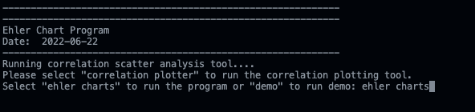
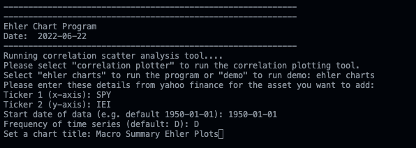
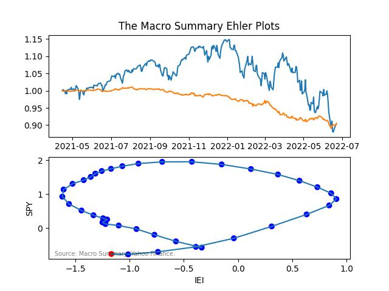
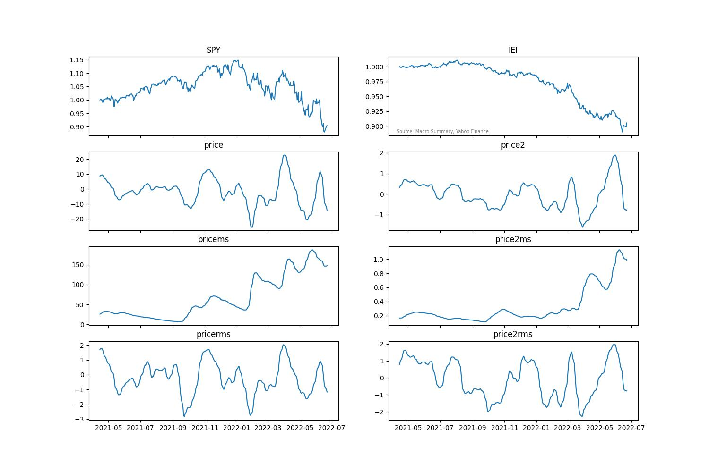

# Ehler Charts
This script creates a plot of a seasonality of an asset using command line.

### Description and usage:
https://macrosummary.substack.com/p/the-seasonality-plotter?s=w

### Warning:
Usage on your own risk.

### Command line
`python ehler-charts.py`
Then enter all requested details, where symbol can be any symbol on yahoo finance.
Do not leave any request empty, otherwise the program exits.

You can also enter spreads like `XOP/SPY` or `TLT-IEI

### Example for SPY and IEI

#### Code set 1

#### Code set 2

#### Plot 1: Ehler plot

#### Plot 2: Ehler indicators

